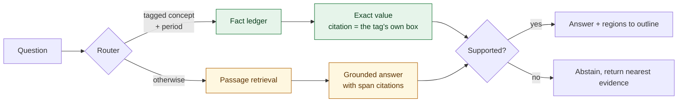

# disclosure-rag

**Question answering over EU annual financial reports, where every answer points at the exact figure
it came from and can be proved again months later.** A router sends questions about tagged figures to
a structured lookup and everything else to retrieval, so numbers are exact rather than approximated,
unsupported questions are declined rather than guessed at, and every answer records the version of
the corpus that produced it.


*"Wie hoch war Zinserträge unter Anwendung der Effektivzinsmethode im Geschäftsjahr 2022?"*
→ `192.900.000,00 EUR`, page 25, outlined above. Note which column: the 2022 figure, not the 185,5
sitting next to it.

## Why route instead of embedding everything

EU issuers file annual reports under ESEF, which is XHTML carrying Inline XBRL. The machine-readable
tag wraps the number a human reads, so the filing itself declares each figure's value, unit, period
and position.

A question about a tagged figure therefore has an exact answer at a known location. Putting that
through a vector search and asking a model to read it back is strictly worse: the answer can be
wrong, and the citation becomes a prediction. So those questions are looked up, and the citation is
the filer's own bounding box rather than an estimate.

Retrieval is used where retrieval belongs, on the narrative and qualitative content that carries no
tags.

## Results

Reproduce with `make eval`. Deterministic, seeded, no API key and no network.

**End to end**, 393 generated cases over eight Austrian filings:

| Measure | n | Result |
|---|---|---|
| Routing accuracy, tagged figures | 160 | **1.000** |
| Answer exact match, tagged figures | 160 | **0.963** |
| Abstention recall, unanswerable questions | 233 | **0.970** |
| Abstention precision | 233 | **0.974** |
| False answer rate on unanswerable questions | 233 | **0.030** |
| Wrong-period traps survived | 80 | **1.000** |
| Dimensional ambiguity detected | 73 | **1.000** |
| Latency p50 / p95 | 393 | **0.7 ms / 3.2 ms** |

Two of those rows are the ones worth reading, and one of them was earned the hard way.

**Wrong-period traps** ask for a real concept in a year the filing does not report, separating
knowing the concept from knowing the period. The system never returns a figure for one.

**Dimensional ambiguity** is the harder case. A concept can be tagged several times for one period,
because equity is reported per component and revenue per segment, and separately because one German
label can be declared for two different concepts: `Vorräte` is both the balance-sheet item and its
cash-flow adjustment. In both cases the question does not identify a single figure, so the system
declines and shows the candidates rather than picking one. It catches all 73.

**Containment is not identification**, and this cost real accuracy before it was fixed. The router
originally asked whether a question contains a tagged concept's label. *"Wie hoch war Erwerb von
Sachanlagen"* asks about a cash flow and contains the label *"Sachanlagen"*, so it returned the
balance sheet carrying amount at full confidence with an exact citation attached, which is precisely
the failure this system claims not to have. The rule is now symmetric: the label also has to account
for most of what the question names. That took the false answer rate from 0.069 to 0.030 at no cost
to exact match. A question with extra qualifiers the filing does not tag now falls back to retrieval
instead, which is degradation rather than error.

**Retrieval**, BM25 over 1829 chunks, scored against bounding boxes taken from the filings' own tags:

| n | Recall@1 | Recall@5 | Recall@10 | MRR@10 | nDCG@10 | Citation IoU@0.5 |
|---|---|---|---|---|---|---|
| 320 | 0.278 | 0.553 | 0.678 | 0.396 | 0.462 | **0.056** |

That last column is deliberately shown rather than omitted, because it is the worst number here and
it is the one that explains the architecture. It asks whether the single figure the system would
outline is the right one, when the answer is reached by retrieval instead of by lookup. At 0.056 it
mostly is not: retrieval finds the right passage, then cannot tell which of the row's figures belongs
to the year asked about, because the column header that distinguishes them is in a different text
block and is gone once the page is linearised.

That is the measurement behind routing tagged figures to the structured layer, where the same
question is answered exactly and the citation is the filer's own tag.

**The retrieval ladder**, same questions, at the 200-token chunk size a 512-token embedder requires:

| Retriever | Recall@5 | MRR@10 | nDCG@10 |
|---|---|---|---|
| **BM25** | **0.478** | **0.352** | **0.401** |
| dense, multilingual-e5-large | 0.159 | 0.089 | 0.122 |
| hybrid, reciprocal rank fusion | 0.303 | 0.203 | 0.268 |

Hybrid retrieval, the obvious choice, loses to plain BM25 by a paired-bootstrap margin of
**-0.319 [-0.378, -0.259]** on the dense step. A question here names a concept by the label the filer
declared, and that label appears verbatim in the row being looked for, so there is no vocabulary gap
for embeddings to bridge and fusing a weaker retriever in only costs ranking positions. BM25 is the
default. [ADR-0005](docs/adr/0005-bm25-default-no-agent-framework.md).

**Label quality**, the gold standard the above is measured against: 2418 of 2420 tagged facts
located, median IoU 0.92 to 0.99 per filing between the tag's location and an independent text search
for the same figure.

**Is the confidence number worth anything?** Expected calibration error over the 161 answers given at
the shipped threshold:

| Confidence band | n | mean confidence | accuracy | gap |
|---|---|---|---|---|
| 0.8 to 0.9 | 3 | 0.800 | 0.000 | **+0.800** |
| 0.9 to 1.0 | 158 | 1.000 | 0.975 | +0.025 |

**ECE 0.040.** The structured path claims 1.0 and is right 97.5% of the time. The three passage
answers above the threshold are confidently wrong, which is the dangerous direction because those are
the answers a reader would not check, and the worst-band figure is reported alongside the average
precisely so one good number cannot hide three bad ones.

Measured only over answers the system actually gave. An abstention's confidence is a support score,
not a prediction that declining was right, so including them would measure nothing.

### Abstention is a chosen operating point, not a default

| Threshold | Exact match on answerable | False answer rate on unanswerable |
|---|---|---|
| 0.50 | 0.963 | 0.258 |
| 0.70 | 0.963 | 0.064 |
| **0.80** | **0.963** | **0.030** |
| 0.90 | 0.963 | 0.017 |

0.8 is the shipped setting. Exact match does not move across the sweep because tagged figures come
through the structured layer at full confidence, so a passage-path threshold cannot affect them. What
it does cost is narrative recall, which this corpus has no gold set for, and that trade is
deliberate: for a document a reader has to verify, an answer they cannot check is worth less than
none.



## An answer you can prove again

A citation into a document nobody can identify is a screenshot, not evidence. Filings get amended,
indexes get rebuilt, settings change, and six months later "page 25, region (0.630, 0.077)" means
nothing on its own.

So every answer carries a **snapshot id**: the hash of every filing's contents together with the
settings that decide what the index holds. It is derived rather than assigned, because an identifier
a human maintains is one that eventually lies.

With an audit log configured, answers are appended to append-only JSONL and any record can be
replayed:

```bash
curl -s localhost:8000/snapshot | jq              # what is currently in force
curl -s localhost:8000/audit/1fe3e35ce688052b     # the recorded answer
curl -sX POST localhost:8000/audit/1fe3e35ce688052b/replay
# { "outcome": "reproduced", "detail": "same snapshot, same answer" }
```

Three outcomes. **Reproduced** means the record is still evidence. **Superseded** means the corpus
moved on, and the reply says which filing changed and how, which is a fact an auditor needs rather
than a failure to hide. **Diverged** means the corpus did not move and the answer did, which is a
defect and the only outcome that should ever be alarming.

The same content hashes make ingest incremental: a no-op rebuild of eight filings takes **0.53
seconds** instead of minutes of headless rendering.

## How it works

Ingestion runs offline: the filing is rendered to PDF, parsed into layout blocks that
keep their page geometry, and chunked so that each chunk carries the list of page regions it covers.
That list is what makes a citation resolvable to a region rather than to a passage, and it is a list
because a table can continue across a page break.

Gold labels come from a separate offline pass that reads the Inline XBRL and locates each tagged
figure by rendering the filing and reading back the PDF link annotations. Retrieval never sees those
tags: a test enforces that `ingest`, `retrieval` and `citation` cannot import the label plane, so the
benchmark cannot quietly measure itself.

Full design in [docs/TECHNICAL_DOCUMENTATION.md](docs/TECHNICAL_DOCUMENTATION.md).

## Stack

Python 3.12, FastAPI, Pydantic, PyMuPDF for layout and rendering, lxml for Inline XBRL, BM25 built
in-repo, optional dense and hybrid retrieval via fastembed, Qdrant supported for larger corpora.
Docker, GitHub Actions, mypy strict, 221 tests.

Generation sits behind a protocol with an extractive implementation as the default, so the service
runs and the benchmark reproduces with no credentials. For a question whose answer is printed in the
document, quoting the sentence and outlining it is correct and cannot hallucinate.

Design decisions and their trade-offs are recorded in [docs/adr/](docs/adr/).

## Running it

```bash
make install                 # uv sync
make check                   # lint, typecheck, 221 tests

make fetch                   # download ESEF report packages into data/filings
make labels                  # build the fact ledgers from them
make eval                    # reproduce every number above
DISCLOSURE_RAG_CORPUS=data/ledgers make run    # API and viewer on :8000
```

Every target is a one-line wrapper, so `make` is a convenience rather than a dependency. Without it,
on Windows or anywhere else:

```powershell
uv sync --extra dev
uv run pytest
uv run python -m disclosure_rag.evaluation.run --ledgers data/ledgers `
    --chunk-tokens 600 --overlap-tokens 20 --out data/results.json
$env:DISCLOSURE_RAG_CORPUS = "data/ledgers"; uv run uvicorn disclosure_rag.app:app --port 8000
```

Or, with the environment already created, `.venv\Scripts\python.exe -m ...` and no `uv` at all.
Rebuilding the ledgers is the one step that needs more: `uv sync --extra labels` and a
`playwright install chromium`, because it renders each filing with headless Chromium.

Open `localhost:8000` for the viewer: pick a filing, ask, and the cited region is drawn on the page.
Each filing offers a few example questions, and those are verified at startup by asking them, so an
example that would abstain is never shown. The viewer is one file with no build step and no external
requests, because the interesting part of this project is the citation rather than the front end.

Or go straight at the API:

```bash
curl -s localhost:8000/documents | jq

curl -s localhost:8000/query -H 'content-type: application/json' -d '{
  "question": "Wie hoch war Zinserträge unter Anwendung der Effektivzinsmethode im Geschäftsjahr 2022?",
  "document_id": "<id from /documents>"
}' | jq

# The regions from that response, rendered onto the page
curl -s "localhost:8000/page/<id>/25.png?regions=0.630,0.077,0.664,0.087" -o citation.png
```

Every response carries per-stage timings, a request id and the snapshot it was produced against.
Logs are structured JSON, and `/metrics` exposes Prometheus counters. The one worth alerting on is
the abstention rate: it rises long before anyone notices a wrong answer, and it is the earliest sign
that a corpus has gone stale or a filing has changed shape.

Set `DISCLOSURE_RAG_AUDIT_LOG` to record answers for later replay.

## Limitations

- **Eight filings.** Enough for the benchmark to be meaningful, not enough to claim generality. The
  corpus is Austrian, so German-language; ESEF is EU-wide so the mechanics are not country-specific,
  and the fetcher takes a country list.
- **Retrieval quality is moderate.** Recall@10 of 0.678 on figure questions is a baseline, not a
  finished component. It matters less than it looks because those questions route to the structured
  layer, but it bounds the narrative path.
- **The narrative path is governed by abstention rather than measured.** A gold set for it needs
  reviewed question and answer pairs. Mechanical extraction produces candidates but cannot promote
  them: a statement row and a narrative sentence restating it contain the same label and the same
  figure, so the available signals do not separate them. `make review` ranks the candidates by how
  much they read like a person writing rather than a table row, and confirms them one keystroke at a
  time. On this corpus that queue is 28 candidates, so the stratum it produces would be small and
  would be reported with its n rather than as a headline.
- **Standard IFRS labels are not always bundled.** Issuers must label their own extension concepts
  but may reference the official taxonomy for the rest, so concept label coverage varies by filer.
  One filing in this corpus declares none at all. Wordings are pooled across the corpus, which gives
  that filing a structured path it otherwise would not have, and it means a question may have to be
  phrased in another issuer's words. Loading the official taxonomy's label linkbase would remove the
  need to borrow.
- **A question that names more than the concept falls back to retrieval.** Asking for revenue "des
  Konzerns" or "des Segments Karton" when the filing tags neither qualifier routes to passages rather
  than returning the unqualified figure. That is the intended trade, and it does mean the structured
  path is reached by plainly phrased questions more reliably than by conversational ones.

## Licence

MIT. See [LICENSE](LICENSE).
