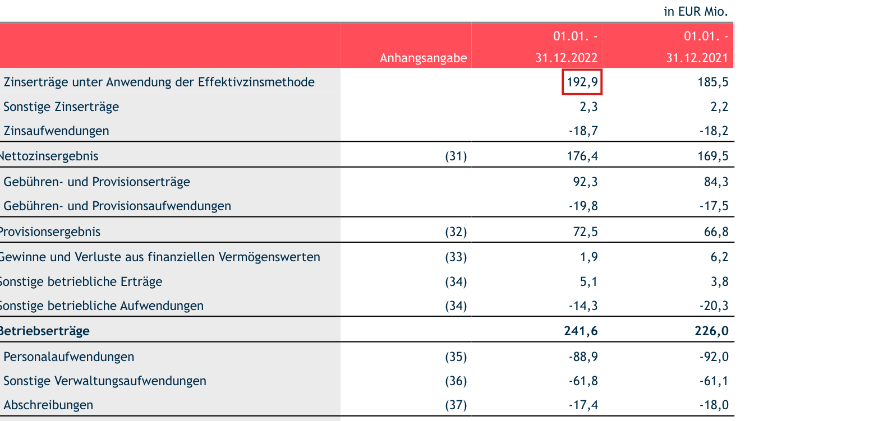
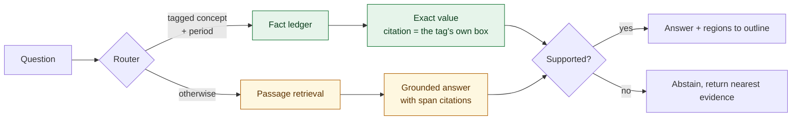

# disclosure-rag

**Question answering over EU annual financial reports, where every answer points at the exact figure
it came from.** A router sends questions about tagged figures to a structured lookup and everything
else to retrieval, so numbers are exact rather than approximated, and unsupported questions are
declined rather than guessed at.



*"Wie hoch war Zinserträge unter Anwendung der Effektivzinsmethode im Geschäftsjahr 2022?"*
→ `192.900.000,00 EUR`, page 25, outlined above. Note which column: the 2022 figure, not the 185,5
sitting next to it.

## Why route instead of embedding everything

EU issuers file annual reports under ESEF, which is XHTML carrying Inline XBRL. The machine-readable
tag wraps the number a human reads, so the filing itself declares each figure's value, unit, period
and position.

A question about a tagged figure therefore has an exact answer at a known location. Putting that
through a vector search and asking a model to read it back is strictly worse: the answer can be
wrong, and the citation becomes a prediction. So those questions are looked up, and the citation is
the filer's own bounding box rather than an estimate.

Retrieval is used where retrieval belongs, on the narrative and qualitative content that carries no
tags.

## Results

Reproduce with `make eval`. Deterministic, seeded, no API key and no network.

**End to end**, 319 generated cases over eight Austrian filings:

| Measure | n | Result |
|---|---|---|
| Routing accuracy, tagged figures | 140 | **0.993** |
| Answer exact match, tagged figures | 140 | **0.936** |
| Abstention recall, unanswerable questions | 179 | **0.955** |
| Abstention precision | 179 | **0.950** |
| False answer rate on unanswerable questions | 179 | **0.045** |
| Wrong-period traps survived | 70 | **1.000** |
| Dimensional ambiguity detected | 39 | **1.000** |
| Latency p50 / p95 | 319 | **0.4 ms / 2.4 ms** |

Two of those rows are the ones worth reading.

**Wrong-period traps** ask for a real concept in a year the filing does not report, separating
knowing the concept from knowing the period. The system never returns a figure for one.

**Dimensional ambiguity** is the harder case. A concept can be tagged several times for one period,
because equity is reported per component and revenue per segment, and separately because one German
label can be declared for two different concepts: `Vorräte` is both the balance-sheet item and its
cash-flow adjustment. In both cases the question does not identify a single figure, so the system
declines and shows the candidates rather than picking one. It catches all 39.

**Retrieval**, BM25 over 1829 chunks, scored against bounding boxes taken from the filings' own tags:

| n | Recall@1 | Recall@5 | Recall@10 | MRR@10 | nDCG@10 | Citation IoU@0.5 |
|---|---|---|---|---|---|---|
| 320 | 0.278 | 0.553 | 0.678 | 0.396 | 0.462 | **0.056** |

That last column is deliberately shown rather than omitted, because it is the worst number here and
it is the one that explains the architecture. It asks whether the single figure the system would
outline is the right one, when the answer is reached by retrieval instead of by lookup. At 0.056 it
mostly is not: retrieval finds the right passage, then cannot tell which of the row's figures belongs
to the year asked about, because the column header that distinguishes them is in a different text
block and is gone once the page is linearised.

That is the measurement behind routing tagged figures to the structured layer, where the same
question is answered exactly and the citation is the filer's own tag.

**Label quality**, the gold standard the above is measured against: 2418 of 2420 tagged facts
located, median IoU 0.92 to 0.99 per filing between the tag's location and an independent text search
for the same figure.

### Abstention is a chosen operating point, not a default

| Threshold | Exact match on answerable | False answer rate on unanswerable |
|---|---|---|
| 0.50 | 0.936 | 0.358 |
| 0.70 | 0.936 | 0.084 |
| **0.80** | **0.936** | **0.045** |
| 0.90 | 0.936 | 0.028 |

0.8 is the shipped setting. Exact match does not move across the sweep because tagged figures come
through the structured layer at full confidence, so a passage-path threshold cannot affect them. What
it does cost is narrative recall, which this corpus has no gold set for, and that trade is
deliberate: for a document a reader has to verify, an answer they cannot check is worth less than
none.

## How it works



Ingestion runs alongside, offline: the filing is rendered to PDF, parsed into layout blocks that
keep their page geometry, and chunked so that each chunk carries the list of page regions it covers.
That list is what makes a citation resolvable to a region rather than to a passage, and it is a list
because a table can continue across a page break.

Gold labels come from a separate offline pass that reads the Inline XBRL and locates each tagged
figure by rendering the filing and reading back the PDF link annotations. Retrieval never sees those
tags: a test enforces that `ingest`, `retrieval` and `citation` cannot import the label plane, so the
benchmark cannot quietly measure itself.

Full design in [docs/TECHNICAL_DOCUMENTATION.md](docs/TECHNICAL_DOCUMENTATION.md).

## Stack

Python 3.12, FastAPI, Pydantic, PyMuPDF for layout and rendering, lxml for Inline XBRL, BM25 built
in-repo, optional dense and hybrid retrieval via fastembed, Qdrant supported for larger corpora.
Docker, GitHub Actions, mypy strict, 164 tests.

Generation sits behind a protocol with an extractive implementation as the default, so the service
runs and the benchmark reproduces with no credentials. For a question whose answer is printed in the
document, quoting the sentence and outlining it is correct and cannot hallucinate.

Design decisions and their trade-offs are recorded in [docs/adr/](docs/adr/).

## Running it

```bash
make install                 # uv sync
make check                   # lint, typecheck, 164 tests

make fetch                   # download ESEF report packages into data/filings
make labels                  # build the fact ledgers from them
make eval                    # reproduce every number above
DISCLOSURE_RAG_CORPUS=data/ledgers make run    # API on :8000
```

Then:

```bash
curl -s localhost:8000/documents | jq

curl -s localhost:8000/query -H 'content-type: application/json' -d '{
  "question": "Wie hoch war Zinserträge unter Anwendung der Effektivzinsmethode im Geschäftsjahr 2022?",
  "document_id": "<id from /documents>"
}' | jq

# The regions from that response, rendered onto the page
curl -s "localhost:8000/page/<id>/25.png?regions=0.630,0.077,0.664,0.087" -o citation.png
```

Every response carries per-stage timings and a request id, and logs are structured JSON.

## Limitations

- **Eight filings.** Enough for the benchmark to be meaningful, not enough to claim generality. The
  corpus is Austrian, so German-language; ESEF is EU-wide so the mechanics are not country-specific,
  and the fetcher takes a country list.
- **Retrieval quality is moderate.** Recall@10 of 0.678 on figure questions is a baseline, not a
  finished component. It matters less than it looks because those questions route to the structured
  layer, but it bounds the narrative path.
- **The narrative path is governed by abstention rather than measured.** A gold set for it needs
  reviewed question and answer pairs. Mechanical extraction produces candidates but cannot promote
  them: a statement row and a narrative sentence restating it contain the same label and the same
  figure, so the available signals do not separate them. The build exports 495 ranked candidates for
  review.
- **Standard IFRS labels are not always bundled.** Issuers must label their own extension concepts
  but may reference the official taxonomy for the rest, so concept label coverage varies by filer.
  Labels are pooled across the corpus to reduce this.

## Licence

MIT. See [LICENSE](LICENSE).
