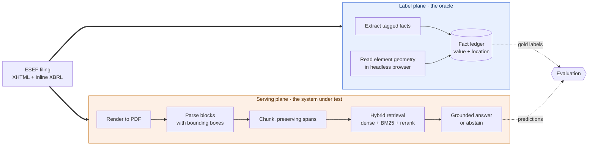

# disclosure-rag: answering questions about financial filings, with receipts

**Retrieval-augmented generation (RAG) over EU annual financial reports. Every claim links to the
exact page and region it came from, and low-confidence answers abstain instead of guessing. The
citations are scored against bounding-box ground truth taken mechanically from Inline XBRL, so
"the citation points at the right place" is a measured number rather than a promise.**

> **Status: design complete, feasibility measured, pipeline not started.** The M0 probe has run
> against 865 tagged facts in real filings and settled two open questions: gold citation boxes can
> be produced mechanically (865 of 865 located, median IoU 0.947), and numeric reconciliation
> cannot be labelled for free (19 of 50 against a threshold of 20), so that feature is cut. The
> numbers in [Measured so far](#measured-so-far) are real. Everything in
> [Targets](#targets) is not yet built. Progress in [docs/ROADMAP.md](docs/ROADMAP.md).

## The problem

Someone checking a published annual report is doing one of two things. Either they are looking for
a disclosure, in a 400-page document, and need to know exactly where it is. Or they are checking
that the narrative agrees with the audited statements: the management report says revenue "grew to
roughly 1.2 billion euro", and the income statement needs to say the same thing.

Most RAG systems handle the first badly and the second not at all. Flattening a PDF to plain text
throws away the table structure that carries the meaning, and a chunk-level citation is not much
help to someone whose whole job is verification. The second problem is not really a retrieval
problem: it is extraction, then unit and scale normalisation, then arithmetic, and language models
are unreliable at the last two.

## The part I actually care about

**A retrieval system can give you a correct answer while citing the wrong place.**

Standard RAG evaluation cannot see this. It scores the answer text and never checks whether the
citation resolves anywhere useful. For a reader who has to verify the claim, an answer that is
right for the wrong reason is worse than no answer, because it costs them the time to discover it.

I want to measure that gap and publish it. The interesting result is not "answer accuracy is 89%".
It is "answer accuracy is 89% and top-1 citation accuracy is 71%, so a meaningful share of correct
answers point somewhere they should not."

### Why this is measurable at all

EU issuers file their annual report under ESEF (Delegated Regulation (EU) 2019/815), which is XHTML
with **Inline XBRL**. The machine-readable tag is not a separate file, it wraps the number you can
see:

```html
<ix:nonFraction name="ifrs-full:Revenue" contextRef="FY2024" unitRef="EUR"
                scale="6" decimals="-6">1,204</ix:nonFraction>
```

So the value, unit, scale and period are declared, and because the tag is an element in a rendered
document, a browser can tell me exactly where it sits on the page. That is gold-standard provenance
obtained mechanically, at scale, with no hand annotation.

Only the primary statements are tagged this way, which is what makes the tags usable as an
independent gold standard: the pipeline itself only ever sees the rendered PDF, never a tag.

I also expected to use the tagged statements as an oracle for checking figures restated in the
untagged narrative. [I measured that and it did not hold up](#measured-so-far), so it is cut.

## How it works

One source document, two independent paths. They meet only inside the evaluation harness, after the
serving side has committed to an answer.



The serving plane never reads a tag. It gets the rendered PDF, the same artefact a person would
open. If the pipeline could see the tags, the benchmark would measure nothing.

Full design in [docs/TECHNICAL_DOCUMENTATION.md](docs/TECHNICAL_DOCUMENTATION.md).

## Why I made these choices

Each of these has a full record in [docs/adr/](docs/adr/), with the alternative I rejected and what
it would take to change my mind.

- **PyMuPDF for parsing** ([ADR-0002](docs/adr/0002-pymupdf-for-parsing.md)). It gives block-level
  bounding boxes natively, runs offline and free, and renders pages with regions drawn on them,
  which is the same code path the citation viewer needs. I previously wrote "LlamaParse / ColPali"
  as though those were two flavours of one thing. They are not: ColPali is a visual retrieval model
  that would delete the chunker and make BM25 and text reranking impossible. That slash was an
  undecided decision wearing the costume of a made one.
- **ESEF filings as the corpus** ([ADR-0003](docs/adr/0003-esef-corpus-and-labels.md)). Real
  documents, and the tagging gives numeric and positional ground truth for free. I had previously
  written "mock filings", which would have made every number I produced meaningless.
- **Citations carry a list of spans, not one box**
  ([ADR-0004](docs/adr/0004-provenance-contract.md)). A table that continues across a page break
  needs two. That is the motivating example, not an edge case, and the earlier single-box schema
  could not express it.
- **No agent framework and no MCP server**
  ([ADR-0005](docs/adr/0005-no-agent-framework.md)). The answer loop is a fixed pipeline with no
  dynamic control flow, so an agent framework would buy nondeterminism and a harder time explaining
  why the system did what it did. That is a bad trade for a project whose entire point is
  verifiability.
- **Hybrid retrieval, but proven not assumed**
  ([ADR-0006](docs/adr/0006-deterministic-evaluation-gate.md)). Dense vectors under-retrieve exact
  figures and identifiers, so lexical matching should help. That is a hypothesis, and it stays
  labelled as one until there is a delta row showing it.

## Measured so far

The M0 probe ran against three Austrian ESEF filings, 865 tagged facts. Thresholds were written
down before it ran. Full detail in [spikes/esef_probe/REPORT.md](spikes/esef_probe/REPORT.md) and
the reasoning in [ADR-0007](docs/adr/0007-m0-probe-outcome.md).

| Question | Threshold | Result | |
|---|---|---|---|
| Can gold citation boxes be produced mechanically? | 90% located | **865 of 865 (100%)**, median IoU **0.947** | pass |
| Can numeric reconciliation be labelled for free? | 20 of 50 | **19 of 50** | fail |

**What each result changed.** The first is the project's foundation and it holds: region-level
citation accuracy is measurable at scale with no hand annotation, so citation IoU stays as the
headline metric. The second is cut. Real cases exist, such as "Die Gesamtaktiva der Addiko Gruppe
beliefen sich zum Jahresende 2022 auf EUR 5.996,4 Mio" resolving to `ifrs-full:Assets`, but not
enough of them to build a benchmark without hand labelling, which was the whole argument for
including it.

Two things the probe also corrected. My first method for locating facts, reading element geometry
in the browser, located **0 of 600**: screen layout and print layout are different layouts, and
Chromium repaginates when printing. Reading PDF link annotations instead fixed it completely. And
there are **no German filings** in the open index, because Germany's officially appointed mechanism
is the Unternehmensregister and it does not publish into it, so the corpus is Austrian: still
German-language, still ESEF.

Roughly a week of work avoided, for an afternoon of measurement. That is what the gate was for.

### First baseline

BM25 over 843 chunks, 117 questions, three Austrian filings. Deterministic, no model, no server, so
the whole run takes seconds and anyone can reproduce it.

| Stratum | n | recall@1 | recall@5 | recall@10 | coverage@1 | shown first when found | tightness |
|---|---|---|---|---|---|---|---|
| exact figure | 117 | 0.231 | 0.462 | 0.538 | 0.231 | **0.429** | 0.025 |

**The bolded number is the point of the project.** When the answer is retrieved at all, it is shown
first only 43% of the time. So on more than half the questions where this system *had* the right
passage, the region it would put in front of a reader is the wrong one. Answer-level scoring cannot
see that, and it is exactly the failure a person doing verification would care about.

Tightness of 0.025 says a citation is currently about forty times larger than the number it is
pointing at, because citations are block-level. That is the headroom, and it is what claim-level
attribution in M5 is for.

This is the easy control stratum, not the headline. Questions name a concept and a period, and the
answer sits in a table row. It is the number to beat, not the number to be proud of.

Getting here took two corrections, both in the measurement rather than the pipeline, both written up
in [ADR-0009](docs/adr/0009-m2-baseline-findings.md). Citation IoU was unreachable by construction,
since a tagged number covers 0.00026 of a page and the block citing it covers 0.0175, so a perfect
citation scored about 0.015 and the threshold was measuring the size difference rather than the
citation. Scoring moved to containment. Then the run still returned 0.000, because questions were
generated from English concept names while the documents are German. They are now built from the
German label the issuer declares in the taxonomy linkbase.

## Targets

Not built yet. These are the numbers I am building toward, published now so that the bar is set
before I can be tempted to move it.

| Metric | Target | Why this one |
|---|---|---|
| Citation IoU@0.5, top-1 | Establish a baseline | The point of the project. Gold boxes confirmed available by M0. |
| recall@5, exact-figure questions | Beat dense-only by a reported margin | Tests the hybrid retrieval claim directly |
| Abstention precision | Reported with a risk-coverage curve | The threshold should come from the curve, not from taste |
| p95 latency | < 4 s | Usable interactively |

Measured on 100 questions, stratified 40 exact-figure, 30 narrative, 30 unanswerable, reported as a
paired bootstrap confidence interval on the delta rather than two bare point estimates. Reasoning
for the sample size is in
[section 9 of the technical documentation](docs/TECHNICAL_DOCUMENTATION.md#9-evaluation-design).

## What could still sink this

The two assumptions I was most worried about have been measured, and one of them failed, which is
why the scope is now smaller than it was this morning. What remains untested:

- **Chunking may not preserve enough context** for a retrieved passage to answer a question, even
  with the geometry intact. Measured in M2 against the baseline.
- **German compound nouns may break lexical retrieval**, which would undercut the hybrid retrieval
  argument that is currently my most confident claim. Decided by the delta row, not by assertion.
- **Table structure may be the binding constraint** rather than text extraction, which would mean
  moving from PyMuPDF to Docling. [ADR-0002](docs/adr/0002-pymupdf-for-parsing.md) names that as
  the upgrade path and the trigger.

The pattern is the same each time: write the threshold down first, measure, and let the result
decide rather than arguing with it.

## Running it locally

```bash
make install   # uv sync
make check     # lint, typecheck, test
make run       # health endpoint on http://localhost:8000/health
```

Only `/health` is implemented. `make spike` reruns the M0 probe from scratch, which downloads real
filings and a Chromium build, then rewrites
[spikes/esef_probe/REPORT.md](spikes/esef_probe/REPORT.md).

## Licence

MIT. See [LICENSE](LICENSE).
