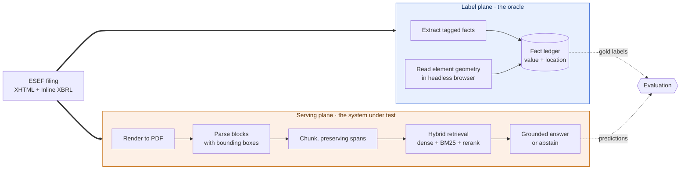

# disclosure-rag: answering questions about financial filings, with receipts

**Retrieval-augmented generation (RAG) over EU annual financial reports. Every claim links to the
exact page and region it came from, and low-confidence answers abstain instead of guessing. The
citations are scored against bounding-box ground truth taken mechanically from Inline XBRL, so
"the citation points at the right place" is a measured number rather than a promise.**

> **Status: design complete, implementation not started.** The architecture, contracts and
> evaluation plan are written. No pipeline code exists yet. Nothing below is described as working,
> and the numbers in [Targets](#targets) are targets, not results. Progress in
> [docs/ROADMAP.md](docs/ROADMAP.md).

## The problem

Someone checking a published annual report is doing one of two things. Either they are looking for
a disclosure, in a 400-page document, and need to know exactly where it is. Or they are checking
that the narrative agrees with the audited statements: the management report says revenue "grew to
roughly 1.2 billion euro", and the income statement needs to say the same thing.

Most RAG systems handle the first badly and the second not at all. Flattening a PDF to plain text
throws away the table structure that carries the meaning, and a chunk-level citation is not much
help to someone whose whole job is verification. The second problem is not really a retrieval
problem: it is extraction, then unit and scale normalisation, then arithmetic, and language models
are unreliable at the last two.

## The part I actually care about

**A retrieval system can give you a correct answer while citing the wrong place.**

Standard RAG evaluation cannot see this. It scores the answer text and never checks whether the
citation resolves anywhere useful. For a reader who has to verify the claim, an answer that is
right for the wrong reason is worse than no answer, because it costs them the time to discover it.

I want to measure that gap and publish it. The interesting result is not "answer accuracy is 89%".
It is "answer accuracy is 89% and top-1 citation accuracy is 71%, so a meaningful share of correct
answers point somewhere they should not."

### Why this is measurable at all

EU issuers file their annual report under ESEF (Delegated Regulation (EU) 2019/815), which is XHTML
with **Inline XBRL**. The machine-readable tag is not a separate file, it wraps the number you can
see:

```html
<ix:nonFraction name="ifrs-full:Revenue" contextRef="FY2024" unitRef="EUR"
                scale="6" decimals="-6">1,204</ix:nonFraction>
```

So the value, unit, scale and period are declared, and because the tag is an element in a rendered
document, a browser can tell me exactly where it sits on the page. That is gold-standard provenance
obtained mechanically, at scale, with no hand annotation.

The asymmetry is what makes it useful: only the primary statements are tagged. The management
report and the narrative repeat the same figures in prose, untagged. **So the tagged statements are
an oracle, and the untagged narrative is the system under test.**

## How it works

One source document, two independent paths. They meet only inside the evaluation harness, after the
serving side has committed to an answer.



The serving plane never reads a tag. It gets the rendered PDF, the same artefact a person would
open. If the pipeline could see the tags, the benchmark would measure nothing.

Full design in [docs/TECHNICAL_DOCUMENTATION.md](docs/TECHNICAL_DOCUMENTATION.md).

## Why I made these choices

Each of these has a full record in [docs/adr/](docs/adr/), with the alternative I rejected and what
it would take to change my mind.

- **PyMuPDF for parsing** ([ADR-0002](docs/adr/0002-pymupdf-for-parsing.md)). It gives block-level
  bounding boxes natively, runs offline and free, and renders pages with regions drawn on them,
  which is the same code path the citation viewer needs. I previously wrote "LlamaParse / ColPali"
  as though those were two flavours of one thing. They are not: ColPali is a visual retrieval model
  that would delete the chunker and make BM25 and text reranking impossible. That slash was an
  undecided decision wearing the costume of a made one.
- **ESEF filings as the corpus** ([ADR-0003](docs/adr/0003-esef-corpus-and-labels.md)). Real
  documents, and the tagging gives numeric and positional ground truth for free. I had previously
  written "mock filings", which would have made every number I produced meaningless.
- **Citations carry a list of spans, not one box**
  ([ADR-0004](docs/adr/0004-provenance-contract.md)). A table that continues across a page break
  needs two. That is the motivating example, not an edge case, and the earlier single-box schema
  could not express it.
- **No agent framework and no MCP server**
  ([ADR-0005](docs/adr/0005-no-agent-framework.md)). The answer loop is a fixed pipeline with no
  dynamic control flow, so an agent framework would buy nondeterminism and a harder time explaining
  why the system did what it did. That is a bad trade for a project whose entire point is
  verifiability.
- **Hybrid retrieval, but proven not assumed**
  ([ADR-0006](docs/adr/0006-deterministic-evaluation-gate.md)). Dense vectors under-retrieve exact
  figures and identifiers, so lexical matching should help. That is a hypothesis, and it stays
  labelled as one until there is a delta row showing it.

## Targets

No results yet. These are the numbers I am building toward, published now so that the bar is set
before I can be tempted to move it.

| Metric | Target | Why this one |
|---|---|---|
| Citation IoU@0.5, top-1 | Establish a baseline | The point of the project. Measured against ledger boxes. |
| recall@5, exact-figure questions | Beat dense-only by a reported margin | Tests the hybrid retrieval claim directly |
| Reconciliation precision | ≥ 0.90 | A false agreement is the worst failure this system can produce |
| Abstention precision | Reported with a risk-coverage curve | The threshold should come from the curve, not from taste |
| p95 latency | < 4 s | Usable interactively |

Measured on 100 questions, stratified 40 exact-figure, 30 narrative, 30 unanswerable, reported as a
paired bootstrap confidence interval on the delta rather than two bare point estimates. Reasoning
for the sample size is in
[section 9 of the technical documentation](docs/TECHNICAL_DOCUMENTATION.md#9-evaluation-design).

## What could sink this

The whole design assumes narrative prose contains enough figures that resolve to tagged facts. If
most narrative numbers turn out to be derived or untagged, the reconciliation capability has no free
labels and the idea is weaker than I think.

So the first thing I build is not the pipeline. It is a five-hour probe that measures exactly that,
with an abort threshold written down in advance: [spikes/esef_probe](spikes/esef_probe/). If fewer
than 20 of 50 sampled narrative figures resolve, the reconciliation work is cut and the project
falls back to disclosure location only. I would rather find that out in an afternoon than in week
four.

## Running it locally

```bash
make install   # uv sync
make check     # lint, typecheck, test
make run       # health endpoint on http://localhost:8000/health
```

Only `/health` is implemented. `make spike` runs the ESEF probe described above.

## Licence

MIT. See [LICENSE](LICENSE).
