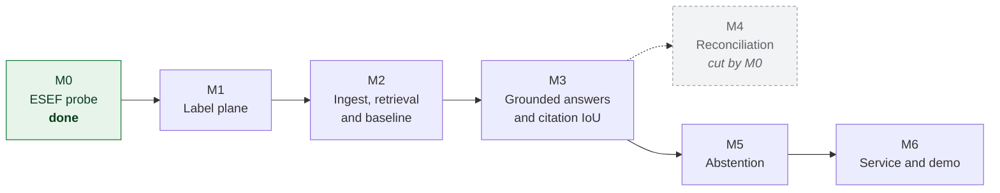

# Roadmap

**Shipped so far: M0 and M1, with M2 in progress.** The feasibility gate ran and cut one milestone
from this list. The label plane is built and produces gold spans. The retrieval pipeline runs end to
end with an ablation ladder, and it has already overturned one of the project's founding decisions.

This file replaces the checklist that used to sit in the README. A checklist reads as a completion
meter, and a meter at zero says less about a project than a dated log of what actually landed.

## Sequence

## M0. ESEF probe (done, 2026-07-29)

The gate. Two assumptions measured against 865 tagged facts in three real filings, with thresholds
fixed before the run.

| Assumption | Threshold | Result | |
|---|---|---|---|
| Gold citation boxes can be produced mechanically | 90% located | 865 of 865, median IoU 0.947 | pass |
| Narrative figures resolve to tagged facts | 20 of 50 | 19 of 50 | fail |

**Consequences: M4 is cut. Region-level citations proceed.** The corpus moved to Austria because
the open index carries no German filings, and the method for locating facts moved from browser
geometry to PDF link annotations because the first approach located nothing.

Evidence in [spikes/esef_probe/REPORT.md](../spikes/esef_probe/REPORT.md), reasoning in
[ADR-0007](adr/0007-m0-probe-outcome.md).

## M1. Label plane

Fact extraction with Arelle, replacing the probe's lxml reader so contexts, continuations and
dimensions are resolved properly. Location by PDF link annotation, which the probe established at
100% coverage. Joined into the fact ledger.

Done when: a committed dataset of located facts for 8 filings, and a rendered page with gold boxes
drawn on it that I have looked at and confirmed are in the right places.

## M2. Ingest, retrieval and the first baseline (in progress)

Built: PyMuPDF block parsing, span-preserving chunking, BM25, dense and hybrid retrieval, question
generation from the ledger, coverage-based scoring, and paired bootstrap intervals on every delta.

The run established, on real documents rather than fixtures, that a table row survives block
extraction intact, that spans propagate through chunking so every gold fact is contained by some
chunk, and that the two renders agree on pagination.

It also caught two problems, both in the measurement rather than the pipeline, and both are fixed.
Citation IoU was unreachable by construction, so scoring moved to containment. Questions were
generated from English concept names against German documents, so they now use the German label the
issuer declares in the taxonomy linkbase. [ADR-0009](adr/0009-m2-baseline-findings.md).

**Baseline, BM25 at 600-token chunks over 120 questions:**

| Stratum | n | recall@1 | recall@5 | recall@10 | coverage@1 | shown first when found | tightness |
|---|---|---|---|---|---|---|---|
| exact figure | 120 | 0.208 | 0.375 | 0.508 | 0.208 | 0.410 | 0.044 |

The ablation ladder now runs: BM25, dense and hybrid, with paired bootstrap intervals on the delta,
plus a chunk-size sweep. It overturned the hybrid retrieval decision from day one and found that the
embedding model's context window constrains chunking hard enough to cost recall@1 two thirds. Results
and caveats in [ADR-0010](adr/0010-ablation-ladder-results.md).

Remaining in M2: a longer-context multilingual embedder, so the dense side is measured without the
chunking constraint. Then a reranker as the next rung. Absolute quality is poor and the likely causes
are table rows fragmenting across chunks and the naive tokenizer against German compounds, which is
risk R3 and still open.

Done when: every component in the stack has a delta row showing what it bought.

## M3. Grounded answers and the number this project is for

Generation with span attribution, the `/query` and `/page` endpoints, and citation IoU@0.5 measured
against the ledger. Then the ablation ladder: plus BM25, plus rerank, plus span-preserving chunking,
each with its own delta row and confidence interval.

Done when: the results table has real rows, including the answer-accuracy versus citation-accuracy
gap that motivated the project.

## M4. Reconciliation (cut by M0)

The plan was to check narrative numeric mentions against the ledger, with the model extracting a
structured claim and the comparison running in Python under an explicit tolerance policy.

Cut, because only 19 of 50 sampled prose figures resolve to a tagged fact and the automated
resolver overcounts. The argument for this milestone was free labels at scale, and that argument
does not survive the measurement. It would return only with hand annotation, which is a different
proposition and would need scoping as such. See [ADR-0007](adr/0007-m0-probe-outcome.md).

## M5. Abstention

Claim-level support checking, a risk-coverage curve, and an abstention threshold derived from that
curve rather than picked because it looked reasonable. Abstention precision and recall reported.

## M6. Service and demo

Docker Compose, the Streamlit citation viewer, the screenshot, and a short recording. The
regulatory positioning section is written here, against a system that can demonstrate it, and not
before.

## Not on this roadmap

The cut list lives in [STACK.md](STACK.md#taken-out-and-staying-out). Nothing on it comes back
without an ADR explaining what changed.
