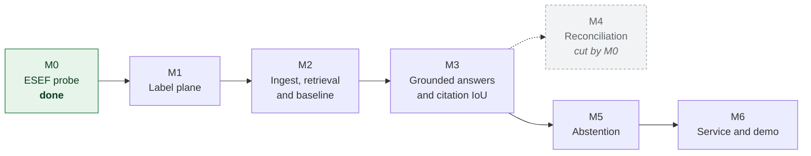

# Roadmap

**Shipped so far: M0.** The feasibility gate has run and its result cut one milestone from this
list. No pipeline code exists yet.

This file replaces the checklist that used to sit in the README. A checklist reads as a completion
meter, and a meter at zero says less about a project than a dated log of what actually landed.

## Sequence

## M0. ESEF probe (done, 2026-07-29)

The gate. Two assumptions measured against 865 tagged facts in three real filings, with thresholds
fixed before the run.

| Assumption | Threshold | Result | |
|---|---|---|---|
| Gold citation boxes can be produced mechanically | 90% located | 865 of 865, median IoU 0.947 | pass |
| Narrative figures resolve to tagged facts | 20 of 50 | 19 of 50 | fail |

**Consequences: M4 is cut. Region-level citations proceed.** The corpus moved to Austria because
the open index carries no German filings, and the method for locating facts moved from browser
geometry to PDF link annotations because the first approach located nothing.

Evidence in [spikes/esef_probe/REPORT.md](../spikes/esef_probe/REPORT.md), reasoning in
[ADR-0007](adr/0007-m0-probe-outcome.md).

## M1. Label plane

Fact extraction with Arelle, replacing the probe's lxml reader so contexts, continuations and
dimensions are resolved properly. Location by PDF link annotation, which the probe established at
100% coverage. Joined into the fact ledger.

Done when: a committed dataset of located facts for 8 filings, and a rendered page with gold boxes
drawn on it that I have looked at and confirmed are in the right places.

## M2. Ingest, retrieval and the first baseline

PyMuPDF block parsing, span-preserving chunking, embeddings into Qdrant, dense retrieval only.
Idempotent one-command re-ingest, because chunking is the parameter I will most want to experiment
with and a painful re-ingest means the experiment never happens.

Then the 100-question evaluation set and a dense-only baseline before adding anything else.

Done when: there is a baseline number I did not choose after seeing the result.

## M3. Grounded answers and the number this project is for

Generation with span attribution, the `/query` and `/page` endpoints, and citation IoU@0.5 measured
against the ledger. Then the ablation ladder: plus BM25, plus rerank, plus span-preserving chunking,
each with its own delta row and confidence interval.

Done when: the results table has real rows, including the answer-accuracy versus citation-accuracy
gap that motivated the project.

## M4. Reconciliation (cut by M0)

The plan was to check narrative numeric mentions against the ledger, with the model extracting a
structured claim and the comparison running in Python under an explicit tolerance policy.

Cut, because only 19 of 50 sampled prose figures resolve to a tagged fact and the automated
resolver overcounts. The argument for this milestone was free labels at scale, and that argument
does not survive the measurement. It would return only with hand annotation, which is a different
proposition and would need scoping as such. See [ADR-0007](adr/0007-m0-probe-outcome.md).

## M5. Abstention

Claim-level support checking, a risk-coverage curve, and an abstention threshold derived from that
curve rather than picked because it looked reasonable. Abstention precision and recall reported.

## M6. Service and demo

Docker Compose, the Streamlit citation viewer, the screenshot, and a short recording. The
regulatory positioning section is written here, against a system that can demonstrate it, and not
before.

## Not on this roadmap

The cut list lives in [STACK.md](STACK.md#taken-out-and-staying-out). Nothing on it comes back
without an ADR explaining what changed.
