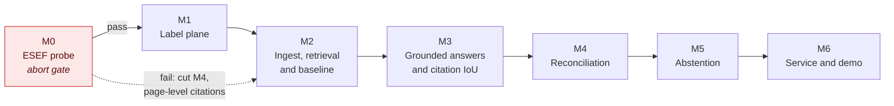

# Roadmap

**Shipped so far: nothing.** The design, the contracts and the evaluation plan are written. No
pipeline code exists.

This file replaces the checklist that used to sit in the README. A checklist reads as a completion
meter, and a meter at zero says less about a project than a dated log of what actually landed.

## Sequence

## M0. ESEF probe

**The gate. Roughly five hours, throwaway code, before anything else is committed to.**

The design assumes narrative prose contains enough figures that resolve to tagged facts, and that
browser geometry maps cleanly onto the printed PDF. Both are assumptions. This measures them.

See [spikes/esef_probe](../spikes/esef_probe/README.md) for the procedure and the abort thresholds.
The outcome is written to `spikes/esef_probe/REPORT.md` and committed whether it passes or fails.

- Fewer than 20 of 50 sampled narrative figures resolve to a tagged fact: **cut M4**, and the
  project becomes disclosure location only.
- Geometry fails on more than 10% of facts, or drifts under print-to-PDF: **drop to page-level
  citations**, say so in the README, and remove the IoU metric rather than fudge it.

## M1. Label plane

Fact extraction with Arelle, element geometry with Playwright, joined into the fact ledger. One
rendering pass producing both the coordinates and the PDF, so the two share a coordinate space.

Done when: a committed dataset of located facts for 8 filings, and a rendered page with gold boxes
drawn on it that I have looked at and confirmed are in the right places.

## M2. Ingest, retrieval and the first baseline

PyMuPDF block parsing, span-preserving chunking, embeddings into Qdrant, dense retrieval only.
Idempotent one-command re-ingest, because chunking is the parameter I will most want to experiment
with and a painful re-ingest means the experiment never happens.

Then the 100-question evaluation set and a dense-only baseline before adding anything else.

Done when: there is a baseline number I did not choose after seeing the result.

## M3. Grounded answers and the number this project is for

Generation with span attribution, the `/query` and `/page` endpoints, and citation IoU@0.5 measured
against the ledger. Then the ablation ladder: plus BM25, plus rerank, plus span-preserving chunking,
each with its own delta row and confidence interval.

Done when: the results table has real rows, including the answer-accuracy versus citation-accuracy
gap that motivated the project.

## M4. Reconciliation

Narrative numeric mentions checked against the ledger. The model extracts a structured claim; the
comparison runs in Python with an explicit tolerance policy. Scoped to directly tagged facts.
Derived quantities such as growth rates are counted as a failure class, not attempted.

Conditional on M0 passing.

## M5. Abstention

Claim-level support checking, a risk-coverage curve, and an abstention threshold derived from that
curve rather than picked because it looked reasonable. Abstention precision and recall reported.

## M6. Service and demo

Docker Compose, the Streamlit citation viewer, the screenshot, and a short recording. The
regulatory positioning section is written here, against a system that can demonstrate it, and not
before.

## Not on this roadmap

The cut list lives in [STACK.md](STACK.md#taken-out-and-staying-out). Nothing on it comes back
without an ADR explaining what changed.
