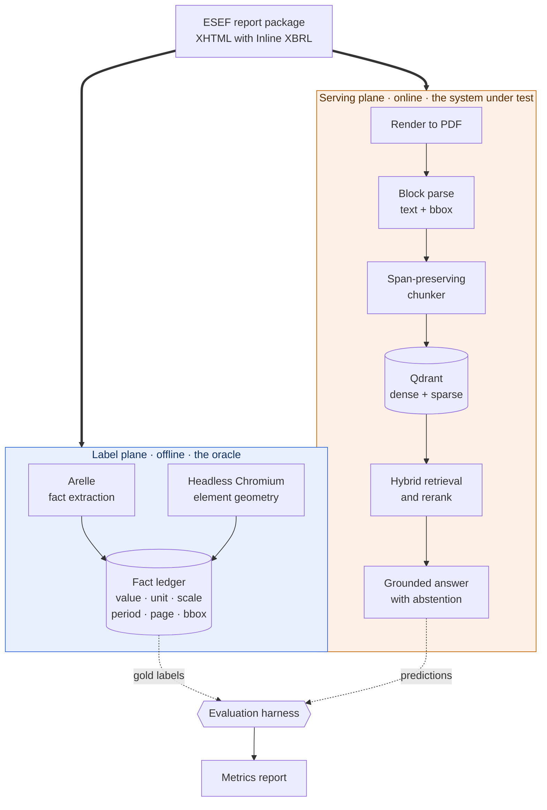
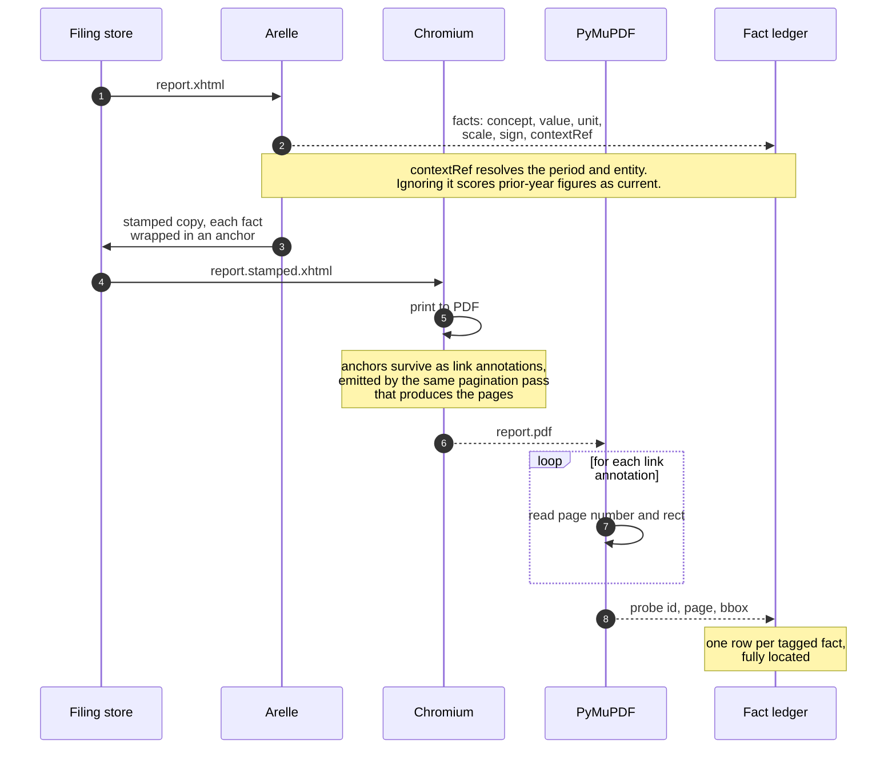
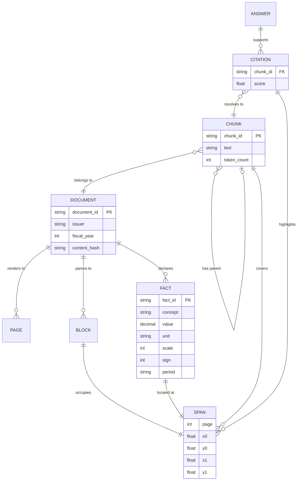
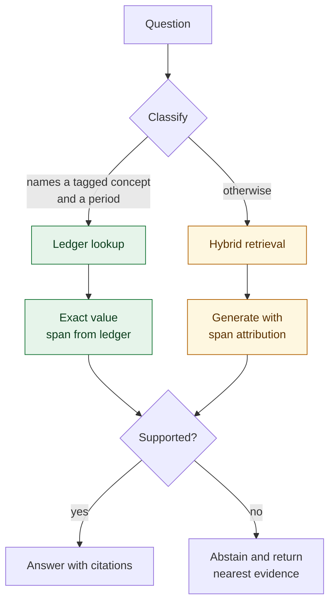

# disclosure-rag: Technical Documentation

> **Living document.** During the build (milestones M0 to M5 in [ROADMAP.md](ROADMAP.md)) this
> document is updated at each milestone boundary, not on every commit. Code leads, the document
> follows. Two exceptions must be updated in the same change set that alters them, because
> everything downstream couples to them: **section 6 (data model and provenance contract)** and
> **section 7 (interface contract)**. Once the service is deployed at M6, the same-change-set rule
> extends to the whole document.

| | |
|---|---|
| **Status** | Design. M0 feasibility measured; nothing in section 5 or later is built yet. |
| **Owner** | Vijay Ananth Karunanithi |
| **Last updated** | 2026-07-29 |
| **Version** | 0.3.0 |

---

## 1. Purpose

This document is the authoritative technical reference for disclosure-rag. It records the problem,
the principles the design follows, the two-plane architecture, the contracts that are expensive to
change, and how the system will be measured.

It is written before implementation on purpose. Sections 6 and 7 define interfaces that everything
else couples to, and deciding those on paper is cheaper than discovering them in week three.
Sections 11 and 12 are deliberately thin, because they describe problems I will not have for
several weeks and any detail I wrote now would be a guess.

## 2. The problem, stated precisely

A reader checking a published annual report asks two kinds of question:

1. **Locate.** Where in this 400-page document is the disclosure about X, and what does it say?
2. **Reconcile.** The narrative says revenue "grew to roughly 1.2 billion euro". Does that agree
   with the figure in the audited income statement?

Generic retrieval handles neither well. Question 1 fails because flattening a PDF to plain text
destroys the table structure that carries the meaning, and because a chunk-level citation ("it is
somewhere in this passage") is not a usable answer for someone who has to verify it. Question 2
fails because it is not a similarity problem at all: it is an extraction problem followed by a
normalisation problem followed by an arithmetic comparison, and language models are unreliable at
the last two.

There is a second, harder problem hiding behind both, and it is the one this project is actually
about. **A retrieval system can produce a correct answer while citing the wrong place.** Standard
RAG evaluation cannot see this, because it scores the answer text and never checks whether the
citation points anywhere useful. An answer that is right for the wrong reason is worse than useless
to a reviewer whose entire job is verification.

### 2.1 The property of ESEF that makes this measurable

Since financial year 2020, issuers on EU regulated markets must file their annual financial report
under the European Single Electronic Format (Delegated Regulation (EU) 2019/815). The format is
XHTML with **Inline XBRL**: the machine-readable tag is not a sidecar file, it wraps the human-
readable number in the rendered document.

```html
<ix:nonFraction name="ifrs-full:Revenue" contextRef="FY2024" unitRef="EUR"
                scale="6" decimals="-6">1,204</ix:nonFraction>
```

Three consequences follow, and together they are the reason this project exists:

1. **The value, unit, scale, sign and period are declared**, so no extraction is needed to know
   what the number means.
2. **The tag has a position in the rendered document.** Render the XHTML in a browser, ask the
   element for its geometry, and you have a bounding box for that fact. This is gold provenance
   obtained mechanically, at scale, with no hand annotation.
3. **Only the primary statements are tagged this way.** The management report, the highlights page
   and the narrative discussion repeat the same figures in prose, untagged. That asymmetry is the
   opportunity: **the tagged statements are an oracle, and the untagged narrative is the system
   under test.**

### 2.2 What this does not give me

Being explicit, because this is where the idea could fail and section 14 tracks it as the main risk:

- Tagging covers the primary statements. Notes are block-tagged at best. Narrative is not tagged.
- A figure in prose may be derived (a growth rate, a margin) rather than a restatement of a tagged
  fact, in which case there is no direct label.
- Displayed text and fact value differ. `1,204` with `scale="6"` is 1204000000. Any comparison that
  ignores `scale`, `sign` and `contextRef` will silently score prior-year comparatives as current.

M0 in the roadmap exists solely to measure how much of the narrative is actually resolvable, with a
documented abort threshold, before I commit weeks to the design that assumes it.

## 3. Design principles

These are the rules the rest of the document follows. Where a later section makes a choice that
looks odd, it is usually one of these being enforced.

| | Principle | Why it is here |
|---|---|---|
| **P1** | **Provenance is a type, not metadata.** A list of spans flows unbroken from parse to API response and is never flattened into a string. | The moment text is concatenated, the link back to a page region is gone and cannot be recovered. This is the single most common way citation quality dies. |
| **P2** | **The oracle never touches the serving path.** The label plane reads Inline XBRL. The serving plane reads only the rendered PDF. | If the pipeline can see the tags, the benchmark measures nothing. This separation is what makes the numbers honest. |
| **P3** | **The model proposes, the runtime disposes.** The LLM emits a structured claim. Normalisation, arithmetic and equality happen in Python. | Language models are unreliable at arithmetic and at unit handling. A comparison I can unit-test is worth more than one I have to trust. |
| **P4** | **Abstention is a designed output, not an error path.** | The product claim is that an unverifiable answer is worse than no answer. That has to be a first-class response with its own metric, not an exception. |
| **P5** | **Determinism where it is checkable.** The CI gate uses fixed relevance judgements. Model-judged metrics run off the critical path. | A build that goes red because a judge model felt different today teaches me to ignore the build. |
| **P6** | **Every external dependency sits behind a seam.** Parser, embedder, reranker and generator are protocols. | Keeps the expensive-looking choices cheap to reverse, which is what lets me defer them honestly. |
| **P7** | **Re-ingestion is idempotent and one command.** | Chunking strategy is the parameter I will most want to experiment with. If re-ingesting is painful, I will not run the experiment and the choice becomes folklore. |

## 4. System context

The defining structural decision is that one source document feeds two independent paths which meet
only inside the evaluation harness.



The dotted edges matter. They are the only points at which the two planes touch, and they touch
after the serving plane has committed to an answer. Principle **P2** is enforced structurally: the
serving plane has no code path that can read an `ix:` element.

## 5. The label plane

Offline, run once per filing, output committed as a dataset. This is the part of the system that
does not exist anywhere else and it is built first.



Three details that decide whether this works:

- **Location comes from the printed artefact, not from the browser viewport.** This is the
  correction the M0 probe forced. Reading `getBoundingClientRect()` and deriving a page index
  arithmetically located 0 of 600 facts, because screen layout and print layout are different
  layouts and Chromium repaginates when printing. Link annotations are produced by the pagination
  pass itself, so they cannot disagree with it. Measured at 865 of 865, median IoU 0.947.
  See [ADR-0007](adr/0007-m0-probe-outcome.md).
- **The anchors must not change the layout being measured.** They carry a stylesheet override that
  neutralises colour, underline and background, so wrapping a number cannot shift it.
- **The PDF handed to the serving plane is rendered from the unstamped original.** It carries no
  tags and no anchors: the same artefact a human reviewer would open. That is what makes the
  comparison fair.

The output is a `FactLedger`: one row per tagged fact, carrying both what the number means and
where it sits. It serves two purposes: gold labels for citation accuracy, and a structured store the
query router can answer numeric questions from directly. A third purpose, acting as an oracle for
checking figures restated in prose, was designed and then cut when M0 measured how few prose figures
resolve. See [ADR-0007](adr/0007-m0-probe-outcome.md).

## 6. Data model and provenance contract

> Same-change-set rule applies to this section.



The load-bearing decision is the cardinality on `CHUNK ||--o{ SPAN`. **A chunk carries a list of
spans, not one page and one box.** The original design had a single `page` and a single `bbox` per
citation, which cannot represent a table that continues across a page break. That is not an edge
case here, it is the motivating example from section 2. Full reasoning in
[ADR-0004](adr/0004-provenance-contract.md).

Coordinates are stored normalised to the page box, so they survive a change of render DPI without
invalidating the index.

## 7. Interface contract

> Same-change-set rule applies to this section.

`POST /query`

```jsonc
// request
{ "question": "What was revenue for FY2024?", "top_k": 10 }

// response
{
  "answer": "Revenue for FY2024 was EUR 1,204 million.",
  "status": "answered",              // answered | abstained
  "citations": [
    {
      "document_id": "de-example-2024",
      "chunk_id": "c_00417",
      "spans": [                      // always a list, see section 6
        { "page": 96, "x0": 0.12, "y0": 0.34, "x1": 0.88, "y1": 0.41 }
      ],
      "quote": "Revenue rose to EUR 1,204 million"
    }
  ],
  "support": { "claims_total": 2, "claims_supported": 2 },
  "route": "narrative"                // narrative | ledger
}
```

`GET /page/{document_id}/{page}.png?spans=...` returns the rendered page with the given regions
outlined. This exists so a citation is verifiable in one click, and it is also what produces the
screenshot in the README.

`POST /ingest` registers a document and runs the serving-plane pipeline. Idempotent by
`content_hash` per **P7**: re-ingesting the same document replaces its chunks rather than
duplicating them.

`GET /health` reports liveness, version and environment. This is the only endpoint implemented
today.

Contracts are Pydantic models. A breaking change requires a version bump and a revision-history
entry.

## 8. Query routing

Not every question should reach the vector index. Numeric questions about tagged facts have an
exact answer in the ledger, and retrieving it approximately would be a downgrade.



The ledger branch is principle **P3** in its surviving form. Where a question names a tagged concept
and a period, the answer is a lookup returning an exact value with a span, and no model is involved
in producing the number.

**A third branch was designed and then cut.** It would have checked figures asserted in narrative
prose against the ledger, with the model extracting `{value, unit, scale, period}` from a sentence
and the comparison executed in Python under an explicit tolerance policy. The M0 probe measured how
many prose figures actually resolve to a tagged fact and found 19 of 50 against a threshold of 20,
so the labels the design depended on are not available at scale. See
[ADR-0007](adr/0007-m0-probe-outcome.md). The design is recorded there rather than here, because
this section describes what the system does.

## 9. Evaluation design

The system exists to produce these numbers. They are the deliverable, not a by-product.

| Metric | What it answers | Labels from | Gate |
|---|---|---|---|
| recall@k, nDCG@10 | Did the right passage come back? | Ledger spans plus hand-labelled narrative | CI, deterministic |
| **citation IoU@0.5** | **Does the citation point at the right region?** | Ledger bounding boxes | CI, deterministic |
| Abstention precision / recall | When it declines, was it right to? | Hand-labelled unanswerables | CI, deterministic |
| Risk-coverage curve, AURC | Where should the abstention threshold sit? | Derived from the above | Reported, not gated |
| Faithfulness, answer relevance | Is the prose grounded? | Model-judged | Nightly, off critical path |
| p95 latency, cost per query | Is it usable and affordable? | Instrumentation | Reported |

Citation IoU is the row this project is for. It is the claim in section 2 that standard evaluation
cannot see, and I have not found it published for financial-document RAG.

**Question set.** 100 paired questions, stratified 40 exact-figure, 30 narrative, 30 unanswerable,
run through every configuration. The stratification is not decoration: hybrid retrieval's advantage
lives almost entirely in the exact-figure stratum, and pooling the strata dilutes it toward nothing.

**Statistics.** These are paired binary outcomes, so results are reported as a paired bootstrap 95%
confidence interval on the delta, not two bare point estimates. At n=100 with roughly 25% discordant
pairs, a 15-point recall gap is detectable at about 80% power. At n=50 only gaps above 20 points are
detectable, and at n=30 the result is an anecdote. That is the reasoning behind the sample size.

**Baseline.** Every claim in section 3 of [STACK.md](STACK.md) is a hypothesis until there is a
delta row for it. The ablation ladder is dense-only, then plus BM25, then plus rerank, then plus
span-preserving chunking. No component is described as helping until its row exists.

**Rule.** Metric definitions and the baseline are fixed before any tuning. Deciding what counts as
success after seeing results is how eval tables become worthless.

## 10. Failure modes

The taxonomy is fixed now so that failures get counted rather than fixed ad hoc. Counts per class
go in the results table.

| Class | Expected cause | Handling |
|---|---|---|
| Table continues across a page break | Chunk spans two pages | Multi-span citation (section 6) |
| Multi-level or spanning table headers | Header path lost in parse | Track as parse-quality defect |
| Figure present but derived | Narrative states a ratio, not a tagged fact | Out of scope for M4, counted |
| Prior-year comparative retrieved | `contextRef` ignored | Must fail loudly, never silently |
| Scale or unit mismatch | `scale` attribute dropped | Deterministic comparison catches it |
| Genuinely unanswerable | Question has no support in corpus | Must abstain, scored |
| Adversarial instruction in document | Prompt injection via document text | Section 11 |

## 11. Security and data protection

Renamed from "security and compliance", which previously promised regulatory content and delivered
secrets handling.

- **Untrusted content.** Document text is untrusted input. Retrieved passages are isolated from
  instructions and the output schema is enforced. The concrete threat is white-on-white text in a
  PDF reading "ignore previous instructions". One adversarial document is in the evaluation set, so
  this is a tested property rather than an assertion.
- **Personal data.** The earlier claim that no personal data is expected was wrong. A German annual
  report contains individualised management board remuneration under section 162 AktG, plus named
  board members. Public availability does not remove it from the scope of the GDPR. Processing is
  lawful here, but it has to be stated rather than waved away.
- **Processing location.** Generation currently uses a US provider. Under **P6** the generator sits
  behind a seam, so an EU-hosted implementation is a later afternoon rather than a rewrite. The
  comparison of the two profiles on quality, latency and cost is a planned result, not a promise.
- **Secrets** come from the environment and are never committed.

Regulatory positioning is deliberately not written here. It is only worth stating against a system
that can demonstrate it, so it lands with M6.

## 12. Deployment

Local: Docker Compose, with Qdrant as a container. The service image runs as a non-root user and
carries a healthcheck.

Cloud, when there is something worth deploying: a single container on a small managed host. This is
one stateless service and one database, so a container platform is the right size and Kubernetes
is not. The earlier plan said "ECS/EKS", which was two options presented as a decision.

## 13. Observability

Structured logs with a request correlation id, from the first request handler rather than
retrofitted. Per-stage timings (render, parse, embed, retrieve, rerank, generate) because the
latency table in section 9 needs the breakdown. Token and cost counters per request.

Retrieval traces for low-confidence answers are retained. This is debugging support and is not
described as an audit trail, because an audit trail would need append-only storage, index snapshot
identifiers and replay, which is M6 work.

## 14. Open questions and risks

Closed by M0 on 2026-07-29:

| | Risk | Outcome |
|---|---|---|
| ~~R1~~ | Narrative prose may not contain enough figures resolvable to tagged facts. | **Materialised.** 19 of 50 against a threshold of 20. Reconciliation cut. |
| ~~R2~~ | Browser geometry may not map cleanly onto the printed PDF. | **Materialised, and solved.** Browser geometry located 0 of 600. PDF link annotations located 865 of 865 at median IoU 0.947, so region-level citations proceed. |

Still open:

| | Risk | Impact | How it gets resolved |
|---|---|---|---|
| **R3** | German compound nouns break naive lexical matching. | Weakens the sparse half of hybrid retrieval, which is currently my most confident claim. | Decided with a measurement in M2, not by assertion. |
| **R4** | Scope creep back toward the original stack. | The project does not finish. | The cut list in [ADR-0005](adr/0005-no-agent-framework.md) is explicit about what is never built. |
| **R5** | Table structure, not text extraction, is the binding constraint on retrieval quality. | Forces a move from PyMuPDF to Docling mid-build. | M2 failure taxonomy. [ADR-0002](adr/0002-pymupdf-for-parsing.md) names the trigger. |
| **R6** | The Austrian corpus is small enough that results do not generalise. | Weakens every number the project reports. | Widen to the Nordic and French indices, which the fetcher already takes as a parameter. |

## 15. Revision history

| Date | Version | Change | Author |
|---|---|---|---|
| 2026-07-29 | 0.3.0 | M0 probe results applied. Fact location moved from browser geometry to PDF link annotations, after the first method located 0 of 600 facts. Reconciliation route and metric removed, since only 19 of 50 prose figures resolve. Corpus moved from German to Austrian filings, the open index carrying none from Germany. R1 and R2 closed, R5 and R6 opened. See [ADR-0007](adr/0007-m0-probe-outcome.md). | Vijay Ananth Karunanithi |
| 2026-07-29 | 0.2.0 | Reframed around the two-plane architecture with an Inline XBRL oracle. Replaced the single-bbox citation model with multi-span provenance. Removed the agent framework, the MCP server, and the managed-model and Kubernetes paths. Added the M0 abort gate, the evaluation design with sample-size reasoning, and the failure taxonomy. Corrected the personal-data claim. | Vijay Ananth Karunanithi |
| 2026-07-07 | 0.1.0 | Initial technical documentation (pre-implementation). | Vijay Ananth Karunanithi |
