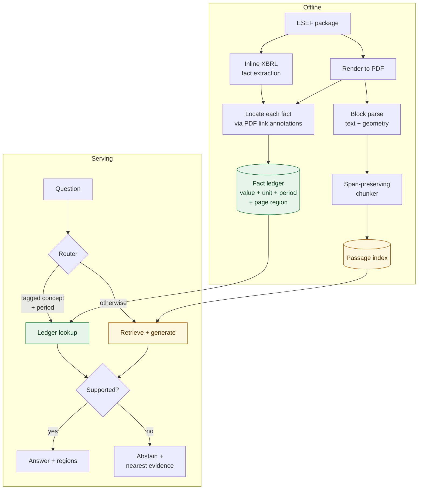
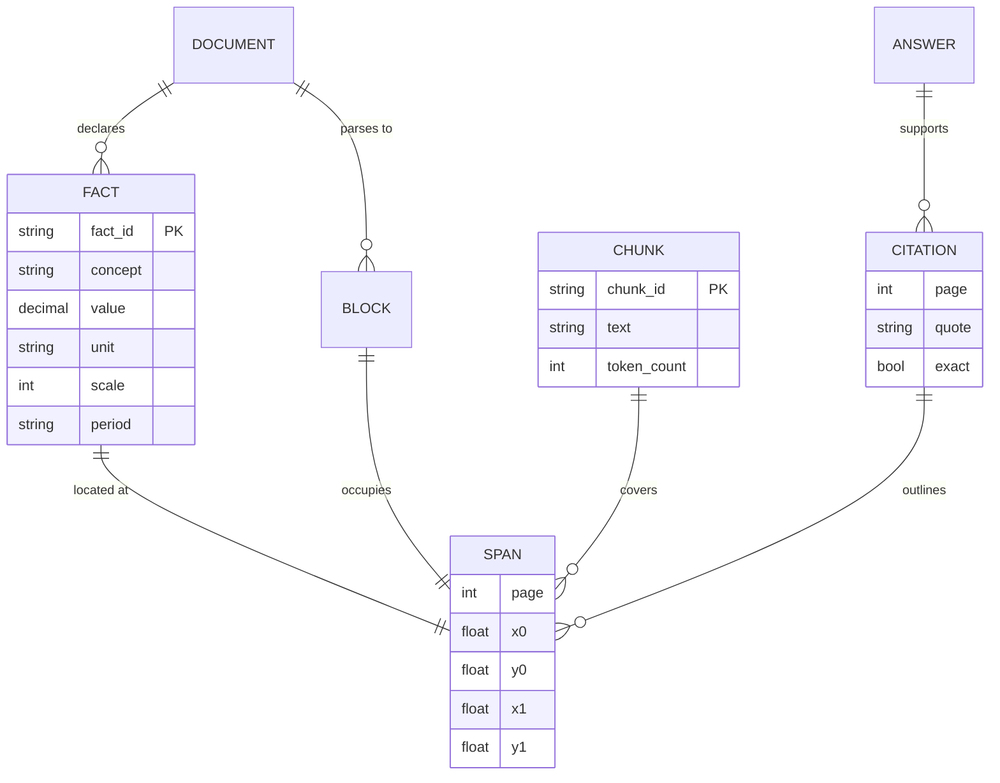

# disclosure-rag: Technical Documentation

| | |
|---|---|
| **Owner** | Vijay Ananth Karunanithi |
| **Version** | 1.0.0 |
| **Last updated** | 2026-07-30 |

Sections 5 and 6 define contracts that everything downstream couples to, so they are updated in the
same change set that alters them. The rest is updated at release boundaries.

---

## 1. What the system does

Answers questions about EU annual financial reports and returns, with every answer, the region of the
page it came from. A router sends questions about tagged figures to a structured lookup, so numbers
are exact and their provenance is the filer's own tag, and sends everything else to retrieval.
Questions it cannot support are declined rather than guessed at.

## 2. Goals and non-goals

**Goals**

- Exact answers for figures the filer tagged, with exact provenance.
- Retrieval over the narrative content that carries no tags.
- Abstention as a designed output, not an error path.
- Every published number reproducible from a seed with no credentials.
- Deployable as a container.

**Non-goals**

- Automated regulatory decisions. This assists a human reviewer.
- Model fine-tuning.
- General chat unrelated to the ingested corpus.

## 3. Why routing

EU issuers file under ESEF, which is XHTML carrying Inline XBRL. The tag wraps the number a human
reads, so the filing declares each figure's concept, value, unit, period and position.

That makes the usual architecture the wrong one for tagged figures. Retrieval puts the right passage
first for 35% of figure questions; a statement row carries several periods' values with the
distinguishing column header in a different text block, so a linearised passage does not say which
value belongs to which year; and the citation becomes a prediction rather than a fact.

Full reasoning and the measurements in
[ADR-0001](adr/0001-route-structured-and-unstructured-separately.md).

## 4. Architecture



**Retrieval cannot read the tags.** A test enforces that `ingest`, `retrieval` and `citation` do not
import the label plane, so the benchmark cannot quietly measure itself. The answer pipeline reads the
ledger by design, because that is what the routing is for.

## 5. Data model and provenance contract

> Same-change-set rule applies to this section.



Coordinates are normalised to the page box, so changing render resolution does not invalidate a
stored index. A chunk and a citation both carry a **list** of spans, because a chunk assembled from
several blocks occupies several regions and a table can continue across a page break.

`Citation.exact` is true when the region is the filer's tag rather than a prediction. Consumers must
not score exact citations as estimates. [ADR-0003](adr/0003-provenance-is-a-list-of-spans.md).

## 6. Interface contract

> Same-change-set rule applies to this section.

`POST /query`

```jsonc
// request
{ "question": "Wie hoch war Umsatzerlöse im Geschäftsjahr 2022?",
  "document_id": "529900...", "top_k": 10 }

// response
{
  "status": "answered",              // answered | abstained
  "route": "ledger",                 // ledger | passage | none
  "text": "192.900.000,00 EUR",
  "value": "192900000.0",
  "unit": "EUR",
  "period": "2022-01-01/2022-12-31",
  "confidence": 1.0,
  "citations": [
    { "document_id": "529900...", "page": 25,
      "spans": [{ "page": 25, "x0": 0.630, "y0": 0.077, "x1": 0.664, "y1": 0.087 }],
      "quote": "192,9", "exact": true }
  ],
  "timings_ms": { "route": 0.34, "ledger": 0.17 }
}
```

`GET /page/{document_id}/{page}.png?regions=x0,y0,x1,y1;...` renders the page with those regions
outlined. The wire format is exactly what a citation returns, so a client hands one straight to the
other.

`GET /documents` lists the corpus. `GET /health` reports liveness, version and document count.

Every response carries an `x-request-id`. Contracts are Pydantic models; a breaking change is a
version bump.

## 7. Evaluation

Deterministic, seeded, no credentials. `make eval` reproduces every published number.

| Suite | Measures |
|---|---|
| Retrieval | Recall@1/5/10, MRR@10, nDCG@10, citation IoU@0.5 |
| End to end | Routing accuracy, answer exact match, abstention precision and recall, false answer rate, wrong-period trap survival, latency p50 and p95 |
| Label quality | Share of tagged facts located, median IoU against an independent text search |

Cases are generated from the ledgers in three classes: answerable figures, unanswerable questions
built from another filing's concepts, and wrong-period traps that ask for a real concept in a year the
filing does not report. Strata are never pooled, a question with no result counts as a miss, and
deltas between configurations are reported as paired bootstrap intervals.
[ADR-0006](adr/0006-deterministic-evaluation.md).

## 8. Security and data protection

- **Untrusted content.** Document text is untrusted input. Retrieved passages are isolated from
  instructions and the output schema is enforced. The concrete threat is white-on-white text in a PDF
  reading "ignore previous instructions".
- **Personal data.** These filings contain personal data. A German or Austrian annual report carries
  individualised management board remuneration and named board members; public availability does not
  remove it from the scope of the GDPR. Processing here is lawful and the corpus is public, but it is
  stated rather than assumed.
- **Processing location.** The default configuration performs no external model calls at all, since
  the extractive generator runs locally. An LLM generator sits behind a protocol, so an EU-hosted
  implementation is a configuration change rather than a rewrite.
- **Secrets** come from the environment and are never committed.

## 9. Deployment and operations

Container runs as a non-root user with a pinned base and a healthcheck. The corpus is supplied by
`DISCLOSURE_RAG_CORPUS` and the service starts cleanly without one, so no data is baked into the
image.

Structured JSON logs with a request correlation id. Per-stage timings on every response. The index is
in memory: at a few thousand chunks a matrix operation beats a network round trip, and Qdrant is
supported behind the `Retriever` protocol for corpora that outgrow one machine.

## 10. Known limitations

- **Three filings.** Enough for the benchmark to be meaningful, not enough to claim generality.
- **Retrieval quality is moderate.** Recall@10 of 0.692 on figure questions is a baseline. It matters
  less than it appears because those questions route to the ledger, but it bounds the narrative path.
- **The narrative path is governed by abstention rather than measured**, pending a gold set for
  qualitative answers.
- **Concept label coverage varies by filer**, so the structured path reaches fewer concepts for issuers
  who reference the official taxonomy instead of declaring labels. Labels are pooled across the corpus
  to reduce this.
