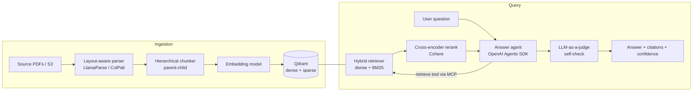

# FinRAG — Technical Documentation

> **Living document.** This is the authoritative technical reference for the system. It **must** be updated in the same change set as any modification that alters the architecture, adds or removes a component, changes an interface or data contract, changes the data model, or changes the deployment topology. Record every such change in the [Revision history](#12-revision-history).

| | |
|---|---|
| **Status** | Draft — pre-implementation |
| **Owner** | Vijay Ananth Karunanithi |
| **Last updated** | 2026-07-07 |
| **Version** | 0.1.0 |

---

## 1. Overview

FinRAG is a retrieval-augmented question-answering system for financial and regulatory documents (annual reports, BaFin filings). It answers natural-language questions grounded strictly in a document corpus and returns **verifiable citations** — page number and bounding-box region — for every claim. A self-correction pass validates answers before they are returned, and low-confidence responses are flagged rather than emitted as fact.

The system is built for a compliance context, where an unsupported or incorrect answer is more costly than an abstention.

## 2. Goals and non-goals

**Goals**
- High-fidelity retrieval over layout-heavy documents (tables, hierarchical sections, footnotes).
- Answer grounding with page- and region-level citations.
- Self-verification (LLM-as-a-judge) and explicit confidence reporting.
- Reproducible retrieval quality measured by an automated evaluation suite.
- Deployable as a containerized service.

**Non-goals**
- Model fine-tuning (covered by a separate project).
- General-purpose chat unrelated to the ingested corpus.
- Automated regulatory decision-making — the system assists a human reviewer, it does not replace one.

## 3. System architecture

## 4. Component design

### 4.1 Ingestion pipeline
- **Parser:** LlamaParse or ColPali, selected to preserve table structure and page geometry. Output retains bounding-box coordinates per block.
- **Chunker:** parent–child hierarchical chunking. Child chunks are embedded for retrieval; the parent provides surrounding context to the LLM.
- **Embeddings:** dense vectors plus a sparse (BM25) representation stored alongside for hybrid search.

### 4.2 Retrieval
- **Hybrid search** in Qdrant: dense semantic similarity fused with sparse lexical matching. Rationale: financial documents contain exact figures, codes, and ticker symbols that dense embeddings under-retrieve.
- **Reranking:** Cohere cross-encoder reorders the fused candidate set before it reaches the LLM.

### 4.3 Answer agent
- Implemented with the **OpenAI Agents SDK**. Loop: plan → call retrieval tool → synthesize → self-check.
- The retrieval layer is exposed as an **MCP server**, so the agent consumes it as a standard tool and the same capability is reusable by any MCP client.

### 4.4 Self-correction
- An LLM-as-a-judge step scores answer faithfulness against retrieved context. Answers below a confidence threshold are flagged for human review rather than returned as authoritative.

## 5. Data model and storage

- **Vector store:** Qdrant collection `finrag_documents`. Each point carries: embedding, sparse vector, source document id, page number, bounding box, parent-chunk reference, and text.
- **Source documents:** object storage (S3 in cloud; local filesystem in dev).
- No PII is expected in the corpus; corpus is public/mock financial filings.

## 6. Interface contract

- **Transport:** FastAPI, async endpoints.
- `POST /query` → `{ question: str, top_k?: int }` returns `{ answer: str, citations: [{document_id, page, bbox}], confidence: float, flagged: bool }`.
- `POST /ingest` → registers and processes a document into the collection.
- `GET /health` → liveness/readiness.
- Contracts are defined with Pydantic models; breaking changes require a version bump and a revision-history entry.

## 7. Evaluation strategy

- **Ragas** measures retrieval hit-rate and answer faithfulness against a labelled question/answer set derived from mock filings.
- Evaluation runs in CI as a **regression gate**: a drop below baseline thresholds fails the build.
- Baselines are recorded here once established (see Revision history).

## 8. Security and compliance

- Secrets via environment / `.env`, never committed.
- Prompt-injection consideration: retrieved document text is treated as untrusted input; the answer prompt isolates instructions from content and enforces an output schema.
- Corpus contains no personal data; if that changes, this section and the data model must be revised.

## 9. Deployment and infrastructure

- **Local:** Docker; Qdrant runs as a container.
- **Cloud:** AWS. Documents in S3; service on ECS/EKS. Bedrock is an optional managed-model path.
- **CI/CD:** GitHub Actions — lint, test, and the Ragas eval gate.

## 10. Observability

- Structured logging with request correlation.
- Latency and token-usage metrics per request.
- Retrieval traces retained for debugging low-confidence answers.

## 11. Build roadmap

1. Ingestion + layout-aware parsing.
2. Hybrid retrieval + reranking.
3. Answer agent + self-correction + citations.
4. MCP retrieval server.
5. Ragas evaluation harness + recorded baselines.
6. FastAPI service + Docker.
7. AWS deployment + citation-viewer UI.

## 12. Revision history

| Date | Version | Change | Author |
|---|---|---|---|
| 2026-07-07 | 0.1.0 | Initial technical documentation (pre-implementation). | Vijay Ananth Karunanithi |
