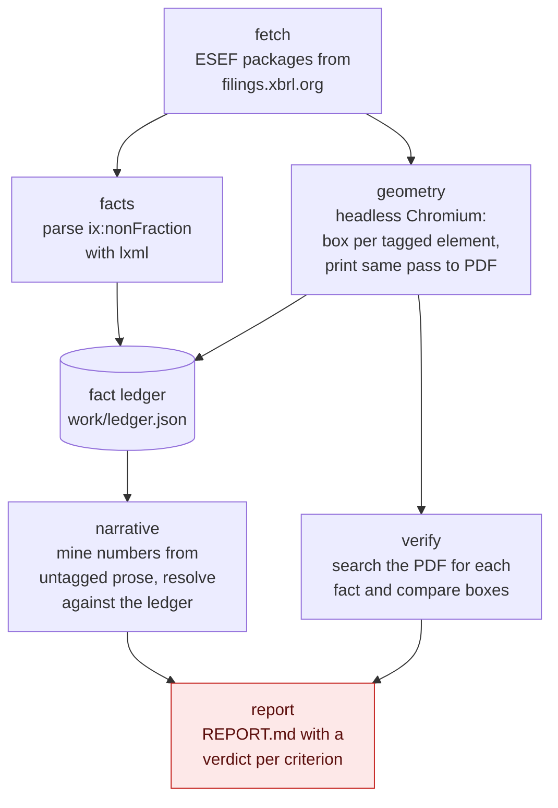

# M0: the ESEF probe

**Purpose: find out whether the central assumption of this project is true, before building
anything on top of it.**

Roughly five hours of throwaway code. The output is
[REPORT.md](REPORT.md), committed whether it passes or fails.

## The assumptions being tested

The whole design in [docs/TECHNICAL_DOCUMENTATION.md](../../docs/TECHNICAL_DOCUMENTATION.md) rests
on two claims that I have asserted and not measured.

**A1. Narrative prose restates enough tagged figures to be worth checking.**
The reconciliation capability assumes that the management report and narrative sections repeat
numbers that appear as tagged facts in the primary statements. If most narrative figures turn out to
be derived (growth rates, margins, ratios) or simply absent from the tagged set, there are no free
labels for the reconciliation task and the strongest part of the idea is much weaker.

**A2. Browser element geometry maps onto the printed PDF.**
The citation benchmark assumes that a bounding box read from a headless browser corresponds to where
that text actually sits on the rendered page. Pagination, CSS page breaks and print stylesheets can
all break that correspondence.

## Abort criteria, written before running it

These are fixed in advance so that the result cannot be reinterpreted after the fact.

| | Measurement | Threshold | If it fails |
|---|---|---|---|
| **A1** | Of 50 sampled narrative numeric mentions, how many resolve to a tagged fact, either exactly or through one derivation step | **20 of 50** | Cut M4 (reconciliation). The project becomes disclosure location only, and the README says so. |
| **A2** | Share of tagged facts whose browser box is confirmed on the predicted PDF page | **90%** | Drop from region-level to page-level citations, state that in the README, and remove citation IoU from the metrics rather than report a number I do not trust. |
| **A2** | Median IoU between the predicted box and the box found in the PDF | **0.5** | As above. |

A partial pass is a real outcome. If A2 holds and A1 fails, the citation benchmark survives and only
reconciliation is cut, which is the most likely mixed result.

## Running it

```bash
make spike
```

That installs the spike extras, downloads a Chromium build for Playwright, and runs the probe.
Working files land in `work/`, which is gitignored because everything in it is large and
reproducible.

To run the stages separately:

```bash
uv run python -m spikes.esef_probe --stage fetch     # download filings
uv run python -m spikes.esef_probe --stage facts     # extract tagged facts
uv run python -m spikes.esef_probe --stage geometry  # browser boxes, render PDF, verify
uv run python -m spikes.esef_probe --stage narrative # sample narrative numbers, resolve
uv run python -m spikes.esef_probe --stage report    # write REPORT.md
```

## What it does



**Verification is the part that makes A2 a measurement rather than a hope.** The browser reports
where it thinks a tagged number sits. The probe then renders the PDF, searches that page for the
number's displayed text with PyMuPDF, and compares the two boxes. Agreement rate and IoU come out of
that comparison, so the answer does not depend on my believing the browser.

## Deliberate simplifications

This is throwaway code answering a yes or no question, so it cuts corners that the real label plane
cannot.

- **lxml rather than Arelle.** Arelle resolves contexts and continuations properly and is the right
  choice for M1. For the probe, reading `ix:nonFraction` attributes directly is fewer moving parts
  and enough to answer the question.
- **Page index is computed arithmetically** from the CSS pixel offset and a fixed page height,
  rather than by tracking real page breaks. That approximation is itself part of what the
  verification step measures.
- **Narrative resolution matches on normalised value**, so it will produce some coincidental
  matches where an unrelated number happens to be equal. The probe writes
  `work/narrative_review.csv` for exactly this reason: the automated pass narrows the field and I
  confirm the sample by hand. The reported figure is the confirmed one.
- **No caching, no retries, no parallelism.** It runs for a few minutes and then it is deleted.

## After it runs

Whatever it finds goes in `REPORT.md` and into the decision log with the date. A failed probe that
cuts a feature in an afternoon is a better outcome than a successful-looking design that collapses
in week four.
